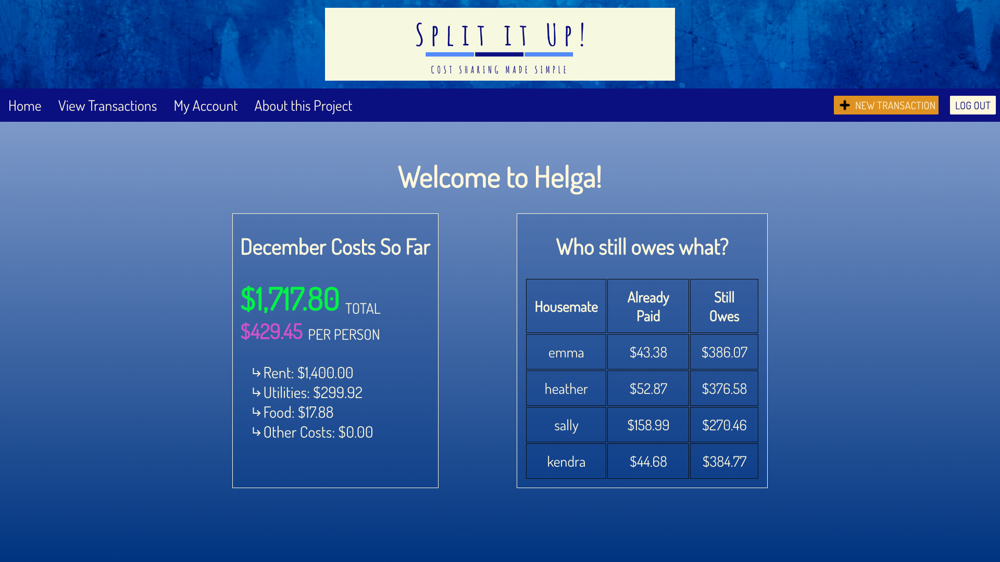
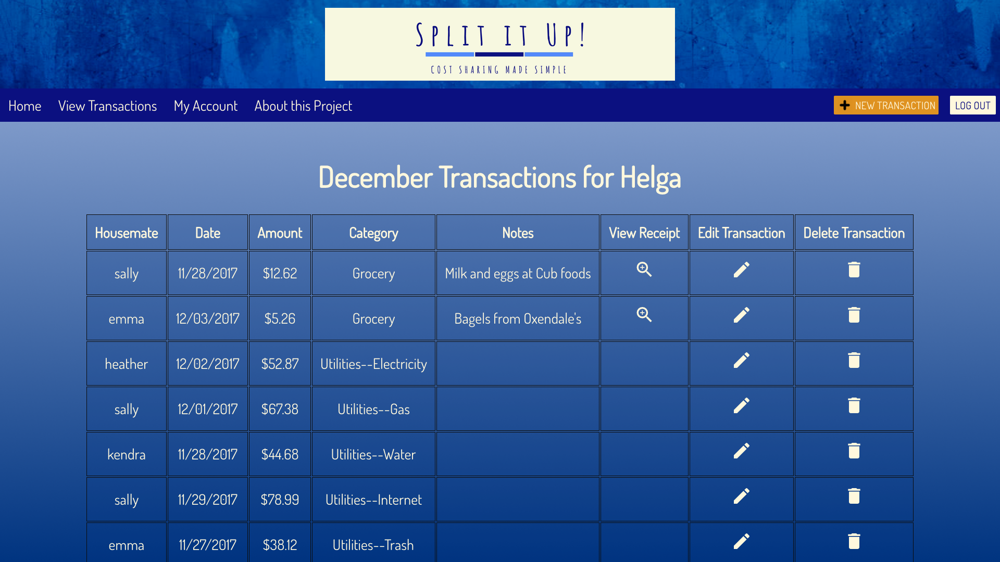

# Split it Up! Cost Sharing Made Simple

Split it Up! is a cost-sharing application that aims to provide housemates with an easy way to track and split up communal house expenses. It allows users to join a house or create an existing house and view a cost dashboard (including a "who still owes what?" table) for their house, as well as a table of all transactions for the month. Users can add, edite, and delete transactions. 


## Built With

AngularJS
Express
Node.js
PostgreSQL
Angular Material
Passport
Moment.js
FileStack API

## Getting Started

These instructions will get you a copy of the project up and running on your local machine for development and testing purposes. 


### Prerequisites

- [Node.js](https://nodejs.org/en/)


### Installing

First, enter the following SQL queries into Postico to create the necessary tables for this project.

```sql
CREATE TABLE "users" (
  "id" serial primary key,
  "username" varchar(80) not null UNIQUE,
  "password" varchar(240) not null
);

CREATE TABLE "houses" (
	"id" serial primary key,
	"houseName" varchar(80) not null UNIQUE,
	"houseCode" varchar(4), 
	"totalRent" INTEGER,
	"closeOutDate" INTEGER	
);


CREATE TABLE "members" (
	"id" SERIAL PRIMARY KEY,
	"user_id" integer REFERENCES "users",
	"house_id" integer REFERENCES "houses"	
);
	
CREATE TABLE "categories" (
	"id" SERIAL PRIMARY KEY,
	"categoryName" varchar(60)	
);

CREATE TABLE "transactions" (
	"id" SERIAL PRIMARY KEY,
	"user_id" integer REFERENCES "users",
	"house_id" integer REFERENCES "houses",
	"date" DATE,
	"amount" INTEGER,
	"category_id" INTEGER REFERENCES "categories",
	"notes" varchar(200),
	"viewReceipt" varchar(80)	
);
```

In a terminal window, navigate to the project folder once saved on your computer.

Run ```npm install```

Make sure postgreSQL is running in an open terminal window.

```npm start```

## Screen Shot





## Documentation

### Completed Features

- [x] Users can create a house or join an existing house
- [x] When users select a house, they are taken to a dashboard displaying a breakdown of monthly house costs
- [x] On house dashboard, users can view a "who still owes what?" table that shows how much each housemate has already paid for the month and how much they still owe toward communal costs
- [x] Users can add a transaction, including select a category for the transaction and upload a photo of the transaction receipt
- [x] Users can edit and delete transactions
- [x] Users can view all transactions for the month in a table
- [x] Users can edit their houses and remove themself from a house


### Next Steps

- [ ] Make the app mobile-responsive
- [ ] Add a feature so that users can compare monthly spending to past months


## Authors

* Emma Stout
